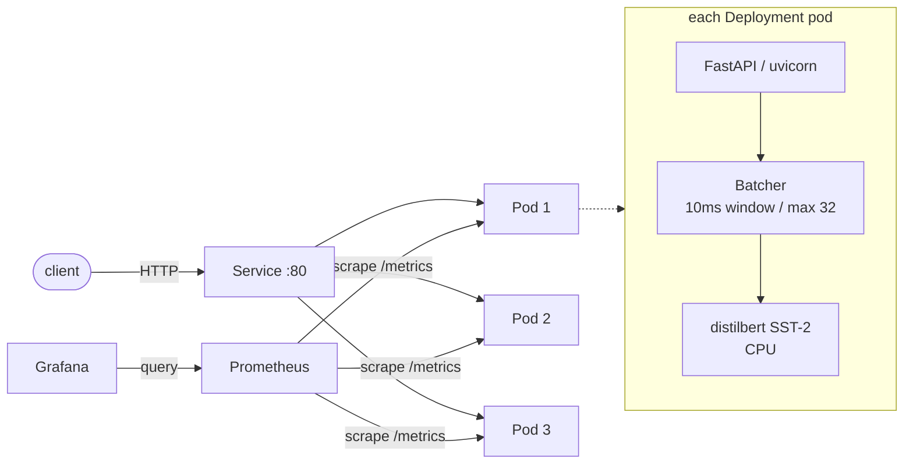
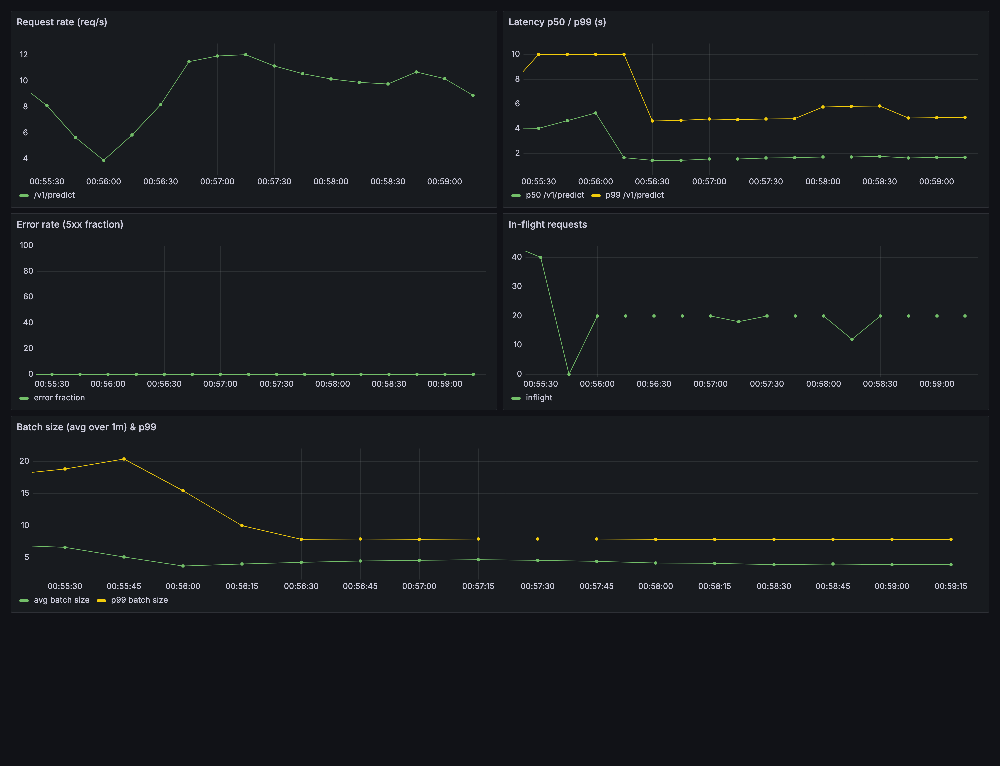
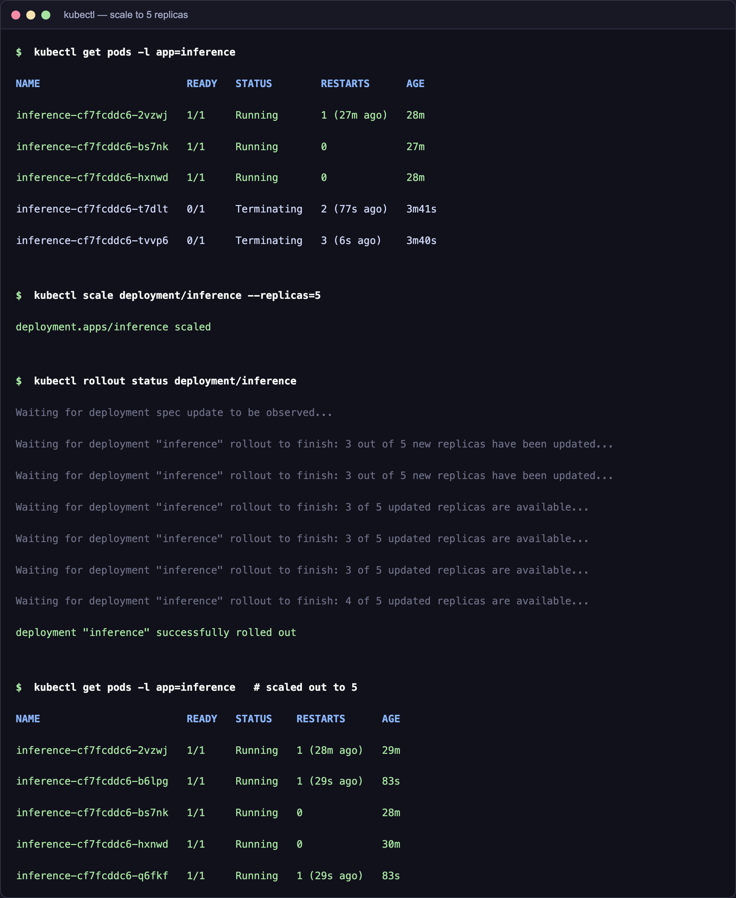
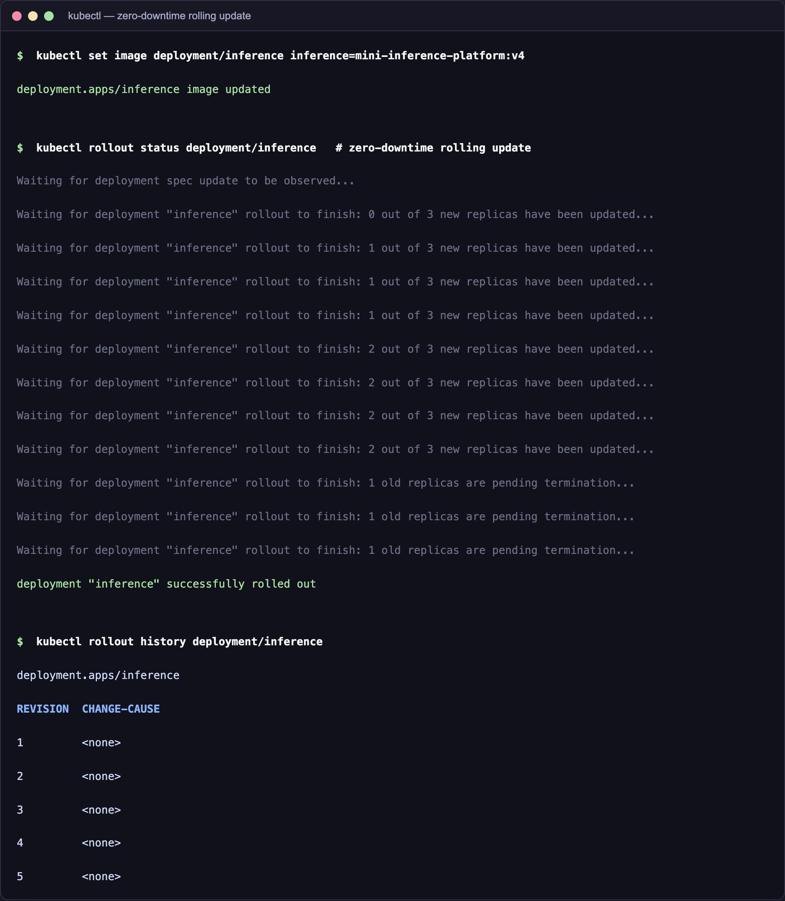
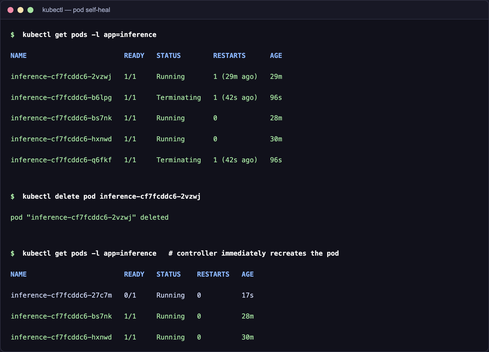
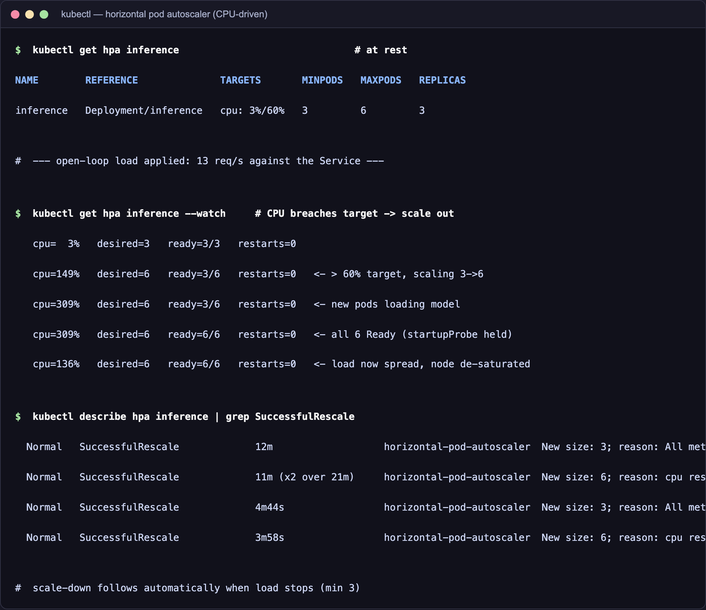

# mini-inference-platform

A sentiment-classification model (`distilbert-base-uncased-finetuned-sst-2-english`)
served behind an **async FastAPI** API with **dynamic request batching**,
containerized with a **multi-stage Docker** build, deployed to a local **kind**
Kubernetes cluster with **3 replicas**, health probes, **Prometheus** metrics, a
**Grafana** golden-signals dashboard, and a **GitHub Actions** CI pipeline. CPU
only, local only — no cloud, no GPU.

## Architecture



Request path: **client → Service → one of 3 Deployment pods → batcher → model**.
Prometheus scrapes `/metrics` on every pod; Grafana reads from Prometheus.

Inside a pod, `/v1/predict` does **not** call the model directly. It submits the
text to an in-process `Batcher`, which collects concurrent requests into a single
batch (flushed at 10ms **or** 32 items, whichever comes first), runs one
`model.predict()` over the whole batch, and resolves each caller's future.

## Endpoints

| Method | Path                  | Purpose                                        |
|--------|-----------------------|------------------------------------------------|
| POST   | `/v1/predict`         | Classify a single text (goes via the batcher)  |
| POST   | `/v1/predict/batch`   | Classify a list of texts in one model call     |
| GET    | `/healthz`            | Liveness — always 200                          |
| GET    | `/readyz`             | Readiness — 200 only once the model is loaded  |
| GET    | `/metrics`            | Prometheus exposition                          |

## Run instructions

### Local (Python 3.11)

```bash
python3.11 -m venv .venv && source .venv/bin/activate
pip install --index-url https://download.pytorch.org/whl/cpu torch==2.2.2
pip install -r requirements.txt

uvicorn app.main:app --host 0.0.0.0 --port 8000
```

Smoke test:

```bash
curl -s localhost:8000/healthz
curl -s localhost:8000/readyz
curl -s -X POST localhost:8000/v1/predict \
  -H 'content-type: application/json' \
  -d '{"text":"I loved this movie"}'
curl -s -X POST localhost:8000/v1/predict/batch \
  -H 'content-type: application/json' \
  -d '{"texts":["great film","worst ever"]}'
```

### Docker

```bash
docker build -t mini-inference-platform:latest .
docker run --rm -p 8000:8000 mini-inference-platform:latest
```

### Kubernetes (kind)

```bash
# 1. Create the cluster
kind create cluster --config kind-config.yaml

# 2. Build and load the image into the cluster
docker build -t mini-inference-platform:latest .
kind load docker-image mini-inference-platform:latest --name inference

# 3. Deploy app + observability
kubectl apply -f k8s/deployment.yaml
kubectl apply -f k8s/service.yaml
kubectl apply -f k8s/prometheus.yaml
kubectl apply -f k8s/grafana.yaml

# 4. Wait for all 3 pods Ready
kubectl rollout status deployment/inference

# 5. (optional) Autoscaling — needs metrics-server, which kind lacks
kubectl apply -f https://github.com/kubernetes-sigs/metrics-server/releases/latest/download/components.yaml
kubectl patch deployment metrics-server -n kube-system --type='json' \
  -p='[{"op":"add","path":"/spec/template/spec/containers/0/args/-","value":"--kubelet-insecure-tls"}]'
kubectl apply -f k8s/hpa.yaml

# 5. Reach the API / dashboards
kubectl port-forward svc/inference 8000:80   &
kubectl port-forward svc/grafana   3000:3000 &
kubectl port-forward svc/prometheus 9090:9090 &
```

Grafana: http://localhost:3000 (anonymous admin enabled) → dashboard
**"Inference Platform — Golden Signals"**.

### Operational demos

```bash
# Scale out
kubectl scale deployment/inference --replicas=5

# Rolling update (new image tag)
docker build -t mini-inference-platform:v2 .
kind load docker-image mini-inference-platform:v2 --name inference
kubectl set image deployment/inference inference=mini-inference-platform:v2
kubectl rollout status deployment/inference

# Self-heal: delete a pod and watch it come back
kubectl delete pod -l app=inference --field-selector status.phase=Running | head -1
kubectl get pods -w

# Autoscale: apply load and watch the HPA grow the fleet on CPU
kubectl get hpa inference --watch
```

### Load test

```bash
# With `kubectl port-forward svc/inference 8000:80` running:
./loadtest.sh
```

This fires `hey -n 5000 -c 50` at `/v1/predict`. Watch the Grafana dashboard:
**batch_size climbs** as concurrent requests get packed together while
**p99 latency stays bounded**.

## Screenshots

All captured from this stack running on a local single-node kind cluster.

### Grafana — golden signals under load



In-cluster load generator at concurrency 20 against the ClusterIP Service.
Request rate ~11 req/s, **in-flight pinned at ~20** (matching the offered
concurrency), **error rate flat at 0**, and the batcher actively packing
requests (avg batch size line) while p50/p99 stay flat. On this small CPU-only
node the sustainable ceiling is ~15 req/s — see [capacity note](#a-note-on-capacity).

### Operational demos

**Scale out to 5 replicas**



**Zero-downtime rolling update**



**Self-heal — delete a pod, controller recreates it**



**Autoscaling — HPA grows the fleet 3 → 6 on CPU, then shrinks back**



CPU utilization is measured as a percentage of each pod's CPU *request* (250m).
A busy inference pod uses close to a full CPU, so even a modest 13 req/s pushes
utilization well past the 60% target and the HPA scales out. As the fixed load
spreads across more replicas, per-pod CPU falls and the cluster de-saturates —
the self-correcting behavior autoscaling is meant to produce. When the load
stops, it scales back to the floor of 3.

### A note on capacity

This runs on a single-node kind cluster (all pods share one Docker VM's 8 CPUs).
Three model-serving replicas plus a load generator saturate that CPU at roughly
15 req/s, after which latency climbs rather than throughput. The batcher's
*throughput* benefit is shown most cleanly by the direct local load test, which
processed **5000/5000 requests at an average batch size of ~18** — i.e. ~18×
fewer model forward passes than one-request-at-a-time serving.

The same ceiling caps autoscaling: a *closed-loop* load (always N requests in
flight) drives the node to saturation no matter how many replicas exist, because
lower latency just turns into more requests/sec. So the HPA demo uses an
*open-loop* fixed-rate load — the correct way to load-test autoscaling — which
lets the cluster de-saturate as it scales. Even so, ~6 fully-busy replicas is the
practical limit on this hardware; a real cluster would right-size CPU `requests`
and run on nodes with room to actually hold `maxReplicas`.

## Design decisions

**Why async.** Inference is CPU-bound, but the API is I/O-bound around it: many
clients connect concurrently and wait. An async event loop lets one worker hold
thousands of pending connections cheaply while the actual `model.predict()` runs
in a thread (`asyncio.to_thread`) so it never blocks the loop. This is what makes
batching possible — many requests can be "in flight" and waiting at once.

**Why batching.** A transformer forward pass has high fixed overhead per call.
Running 32 texts in one pass is far cheaper than 32 separate passes. The batcher
amortizes that overhead across concurrent requests, raising throughput
dramatically under load, at the cost of at most ~10ms of added latency per
request. The 10ms window / 32-max bounds keep tail latency predictable: a request
never waits longer than the window for a batch to flush.

**Why readiness ≠ liveness.** They answer different questions.
*Liveness* (`/healthz`) asks "is the process alive?" — it returns 200 the moment
uvicorn is up. If it fails, Kubernetes restarts the pod. *Readiness* (`/readyz`)
asks "can this pod serve traffic?" — it returns 503 until the model has finished
loading (tens of seconds on CPU). If we used the readiness check for liveness,
Kubernetes would kill pods that are merely still loading the model, crash-looping
forever. Separating them lets a slow-starting pod stay alive while being kept out
of the Service's endpoints until it's actually ready.

**Why a `startupProbe`.** Readiness keeps a loading pod out of rotation, but the
*liveness* probe still has its own clock — and a fixed `initialDelaySeconds`
can't cover a model load whose duration varies wildly. When the HPA scales out
*under load*, the node is already busy, so new pods load the model slowly and
blow past the liveness budget — Kubernetes kills them mid-load and they never
come up, so the fleet can't actually grow. A `startupProbe` fixes this exactly:
it gates both liveness and readiness until the app has started (up to 150s here),
then hands off to a fast steady-state liveness check. This is what lets the
autoscaler add healthy replicas while the cluster is hot. (Also discovered the
hard way — the HPA scaled but the new pods restart-looped until this was added.)

**Why pin torch threads (`TORCH_NUM_THREADS=1`).** By default PyTorch sizes its
intra-op thread pool to the host core count — fine for one process, pathological
under a Kubernetes CPU limit. Each of the 3 replicas would spawn ~Ncore inference
threads, all contending for the same node cores, and the 1-CPU `limit` turns that
contention into CFS throttling: latency blows up to multiple seconds and even the
trivial `/readyz` probe times out, so pods get marked unready and restart in a
loop. Capping torch (and OMP/MKL) threads to the pod's CPU budget keeps each
replica within its lane — this was the single most important fix for stable
behavior under load. (Discovered the hard way during this build.)

**Why resource limits.** `requests` (250m CPU / 512Mi) let the scheduler place
pods sensibly and guarantee a baseline. `limits` (1 CPU / 1Gi) cap a pod so a
runaway request or memory leak can't starve neighbors on the node — the container
is throttled or OOM-killed instead of taking the whole node down. For CPU
inference, the CPU limit also keeps latency predictable across replicas.
```
